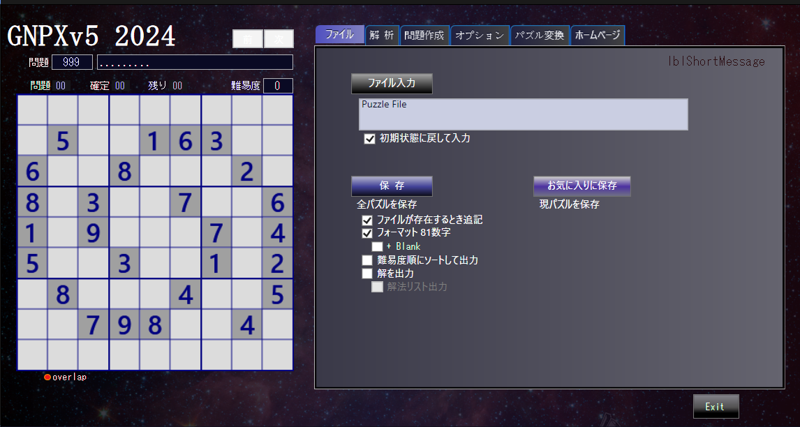

# Sudoku_Solver_Generator_v6.0 beta
  アップデートしました(20240418)。

# コードの配布 再開　-> Sudoku_Solver_Generator_v6

# GNPX v5 HP:
  en: https://gidoo-code.github.io/Sudoku_Solver_Generator_v6/ 
  jp: https://gidoo-code.github.io/Sudoku_Solver_Generator_v6_jp/ 
  
# Sudoku_Solver_Generator v5
 

## 1. GNPX v5 は、プログラムを大幅に改良しています。 
   GNPX v5 は、新アルゴリズムの開発・展開のバージョンです。スマートさは二の次です。 
   数独の解析アルゴリズム部分では、従来のコードとの連続性はありません。 

## 2. 数独解析アルゴリズムについて検討しました。 
   論理を説明するイメージ図を用いて解説します。（具体的では本質が理解しづらい） 
  (1) 数独解析における "Locked" 
  (2) ALSの拡張(AnLS)、アルゴリズムの開発 
  (3) eLink、ネットワークの拡張 
  (4) Fish のファミリー 
  (5) SueDeCoq のファミリー 
  (6) DeathBlossomのアルゴリズム考察 

## 3. GNPX v5 プログラム 
  (1) 多くの解析アルゴリズムを改良 
  (2) ビット表現(Bit81をUInt128に変更) 
